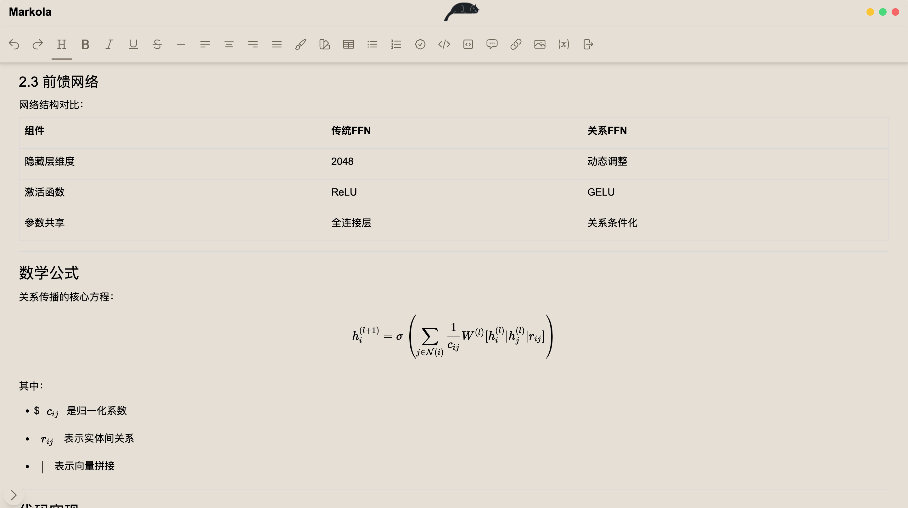

# Markola  一个功能强大的跨平台笔记本软件

Markola 是一个功能丰富的笔记本软件，支持 Markdown 语法、文字颜色、高亮、对齐、图片、链接、表格等功能，同时提供漂亮的界面和动画效果。无论是记录笔记、整理知识，还是导出为 PDF 或 HTML，Markola都能满足你的需求。


---

## 功能特性

### 已实现功能
- **所见即所得**：支持根Typora所见即所得的编辑模式
- **Markdown 支持**：支持大部分 Markdown 语法，轻松编写格式化的笔记。但不仅仅是markdown
- **文字颜色**：为文字添加颜色，突出重点内容。
- **文字格式**：下划线、删除线、加粗、斜体
- **高亮**：支持文本高亮，方便标记重要信息。
- **对齐**：支持左对齐、右对齐、居中对齐。
- **任务清单**：支持任务清单
- **列表**：支持无序列表和有序列表
- **图片支持**：插入图片，丰富笔记内容。
- **链接支持**：插入超链接，快速跳转到相关资源。
- **表格支持**：创建和编辑表格，整理结构化数据。
- **文件分组**：将笔记分组管理，方便分类和查找。
- **导出功能**：支持将笔记导出为 PDF 和 HTML 格式。
- **动画效果**：界面中有一只可爱的小猫动画，增添趣味性。
- **漂亮界面**：简洁美观的界面设计，提升使用体验。
- **公式支持**：支持 LaTeX 公式渲染。支持行内公式`$x^2$`和块状公式`\[x^3+x5^5\]`

### 待开发功能

- **画布功能**：支持手绘和图形绘制。
- **导出为 Markdown**：支持导出为 Markdown 文件

---


## 截图

 
 

---

## 技术栈
- **前端**：React
- **Markdown 渲染**：Tiptap
- **动画效果**：Lottie
- **界面设计**：Tailwind CSS
---

## 构建

### 构建所有平台的包
```
npm run build
```

### 构建指定平台的包

```
npm run build:electron -- --win
npm run build:electron -- --mac --x64
npm run build:electron -- --mac --arm64
npm run build:electron -- --linux  --x64
npm run build:electron -- --linux  --arm64
```

如果出现无法下载的，使用镜像源
```
export ELECTRON_MIRROR="https://npmmirror.com/mirrors/electron/"
```

### 创建图标
> 如果需要更新图标,可以通过以下命令构建新图标
```
./node_modules/.bin/electron-icon-maker --input=build/icon.png --output=build/
```

---

## 许可证
本项目采用 [MIT License](LICENSE)。

---

## 联系方式
如有问题或建议，请通过以下方式联系我：
- **邮箱**：bennetty74@gmail.com
- **GitHub Issues**：[提交 Issue](https://github.com/bennetty74/markola/issues)

---

## 致谢
- 感谢 [tiptap](https://tiptap.dev/) 提供的 Markdown 解析器。
- 感谢 [Lottie](https://lottiefiles.com/) 提供的动画支持。
- 感谢所有贡献者和用户的支持！

---

## 支持
如果喜欢这个项目，请给我一个 ⭐️ 支持！


